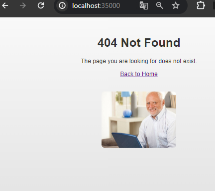
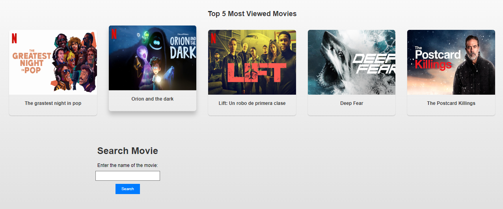
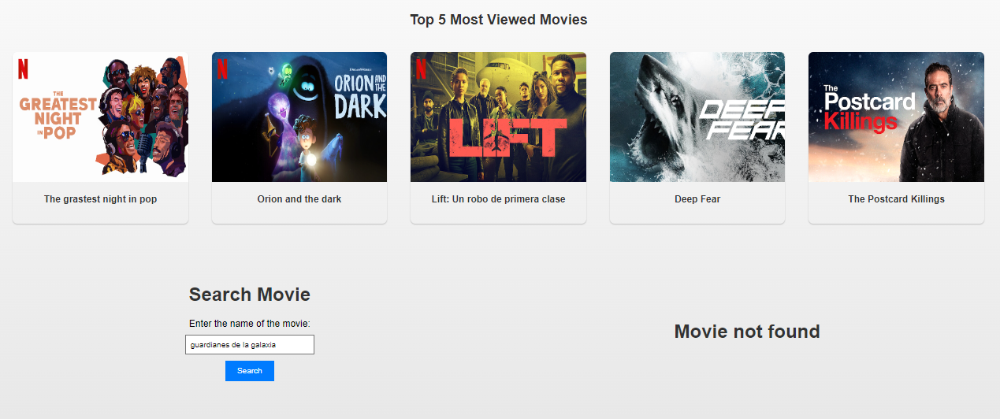

# Taller 2: Diseño y estructuración de aplicaciones distribuidas en internet.

El objetivo del taller es construir una aplicación para consultar la información de películas de cine. La aplicación recibirá una frase de búsqueda del título, por ejemplo “Guardians of the galaxy” y deberá mostrar los datos de la película correspondiente. A su vez, el servidor servidor web debe soportar múlltiples solicitudes seguidas (no concurrentes). El servidor debe leer los archivos del disco local y retornar todos los archivos solicitados, incluyendo páginas html, archivos java script, css e imágenes.

Para lo anterior, se utilaza el API gratuito de [OMBd](https://www.omdbapi.com/).

## Iniciando

Estas instrucciones le permitirán obtener una copia del proyecto en funcionamiento en su máquina local para fines de desarrollo y prueba.

### Prerequisitos

Qué cosas se necesitan para ejecutar el software.

* Git
* Maven
* Java

### Instalación	y ejecución

A continuación se presentan los pasos para obtener una copia del proyecto en funcionamiento en su máquina local.

* Clonar el proyecto
    ```bash
    git clone https://github.com/An6ie02/AREP-TALLER-02.git
    cd AREP_TALLER_02
    ```
* Compilar el proyecto
    ```bash
    mvn clean compile
    ```
* Ejecutar el proyecto
    ```bash
    mvn exec:java -Dexec.mainClass="edu.escuelaing.arep.distributed.HttpServer"
    ```
* Diríjase a su navegador de preferencia y vaya a la siguiente dirección: [http://localhost:35000/index.html](http://localhost:35000//index.html) para ver la aplicación en funcionamiento, como se muestra a continuación:

    Página resultante de ingresar a [http://localhost:35000/](http://localhost:35000/)\
     \
    Página principal de la búsqueda.\
    \
    Página resultante de buscar la película "Armero".\
    \
    Caso en el que la película no existe o no se encuentra.\
    

## Ejecutando las pruebas

Para ejecutar las pruebas, corra el siguiente comando:

```bash
mvn test
```
Las pruebas confirman que la aplicación funciona correctamente. Se comprueba que al hacer una búsqueda de una película, se obtiene la información de la misma en formato JSON. Tambien se comprueba que al hacer una búsqueda de una película que no existe, se obtiene un mensaje de error y finalmente, que la información de la película corresponde a la consultada.

Adicionalmente se realizan pruebas de lectura de archivos, para verificar que el servidor pueda leer los archivos del disco local y retornar todos los archivos solicitados, incluyendo páginas html, archivos java script, css e imágenes.

## Documentación

Para generar la documentación de la aplicación, debe ejecute el siguiente comando.

```bash
mvn javadoc:javadoc
```
El anterior comando crea un archivo con la documentación de la aplicación, esta la puede encontrar en `./target/site/apidocs/index.html`.

## Construido con

* [Maven](https://maven.apache.org/) - Administrador de dependencias
* [OMDAPI](https://www.omdbapi.com) - API externa de consulta
* [Documentation: Reading, Writing, and Creating Files](https://docs.oracle.com/javase/tutorial/essential/io/file.html) - Documentación de Java para lectura y escritura de archivos

## Autor

* **Angie Natalia Mojica** [Angie Natalia Mojica](https://www.linkedin.com/in/angienataliamojica/)

## Acknowledgments

* Al profesor [Luis Daniel Benavides Navarro](https://www.linkedin.com/in/danielbenavides/) por la guía y la enseñanza en el curso de Arquitecturas Empresariales.
